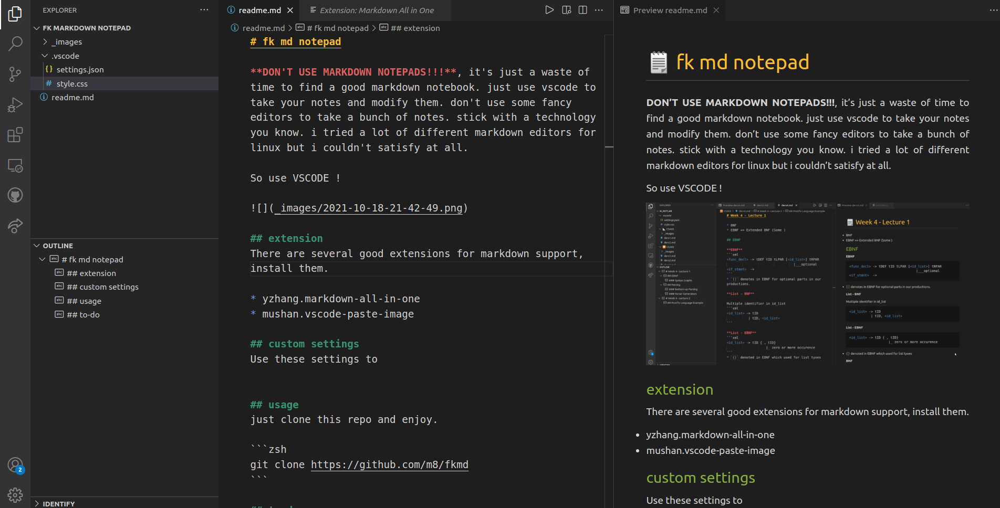

# fk md notepad

**DON'T USE MARKDOWN NOTEPADS!!!**, it's just a waste of time to find a good markdown notebook. don't use some kind of fancy editors to take a bunch of notes. stick with a technology you know. i tried a lot of different markdown editors for linux but i couldn't satisfied at all.

So use **VSCODE** !



## extensions
there are several good extensions for markdown support in vscode, install them.

* yzhang.markdown-all-in-one
* mushan.vscode-paste-image
* bierner.markdown-image-size

## modifications
you can modify anything you want; modify your `.vscode/settings.json` and `style.css` file.

## usage
just clone this repo and enjoy.

```zsh
git clone https://github.com/m8/fkmd
```

## to-do
- add custom actions for notepad
- add other stylesheets